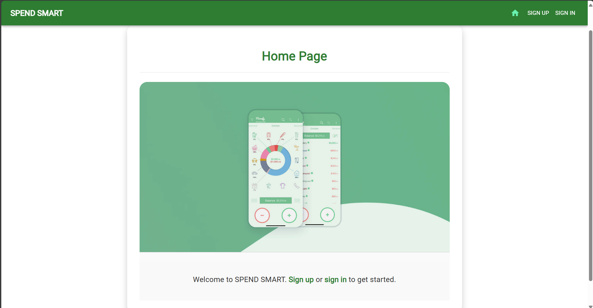
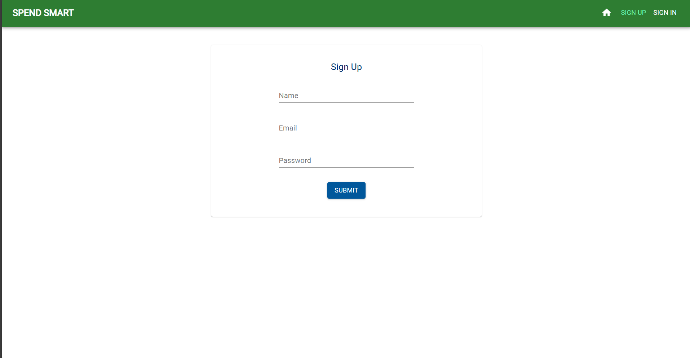
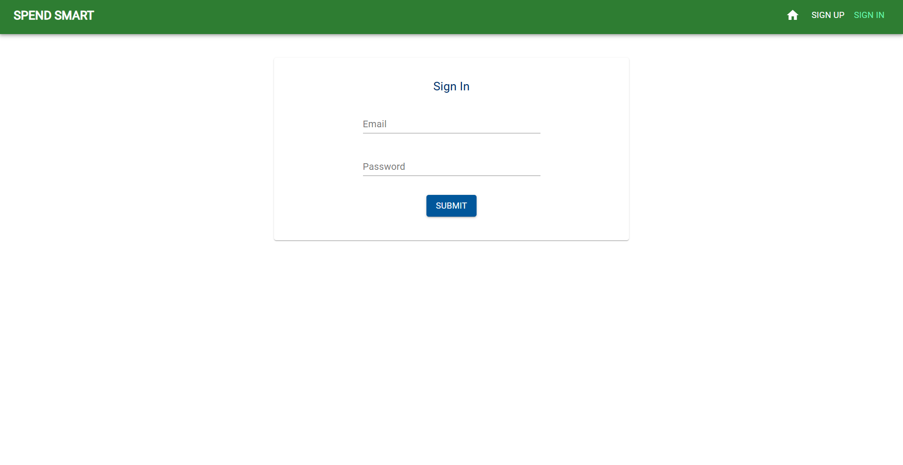
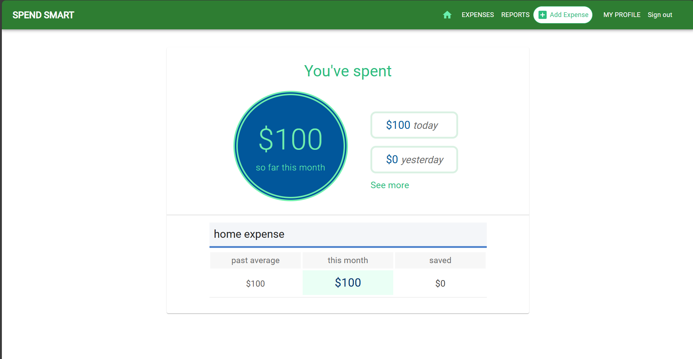

# Spend Smart

## Overview
Spend Smart is a web application built using the MERN stack (MongoDB, Express.js, React.js, Node.js) to help users manage their expenses efficiently.

## Features
- **User Authentication:** Secure user registration and login using JWT tokens.
- **Expense Management:** Add, edit, and delete expenses with categories and dates.
- **Dashboard:** Visual representation of expenses using charts and graphs.
- **Search and Filter:** Easily search for expenses and filter by date or category.
- **Responsive Design:** Mobile-friendly interface for seamless use on any device.

## Installation
To run this project locally, follow these steps:

1. Clone the repository:
git clone https://github.com/sandarbhkansal007/Spend_Smart.git

3. Install dependencies:
npm install
npm run development

